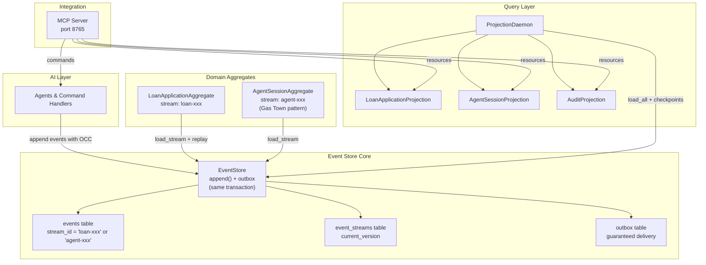

# DOMAIN_NOTES.md

**TRP1 Week 5 – The Ledger**  
**Author**: Yakob Dereje  
**Date**: March 18, 2026

## 1. EDA vs. ES distinction

A component that uses callbacks (like LangChain traces or the `_record_node_execution` calls in `ledger/agents/base_agent.py`) is **Event-Driven Architecture (EDA)**. Events are fire-and-forget notifications that can be dropped, duplicated, or lost. The starter code before the EventStore is pure EDA.

If redesigned with The Ledger:

- Every LangGraph node and tool call in the 5 agents (DocumentProcessingAgent, CreditAnalysisAgent, FraudDetectionAgent, ComplianceAgent, DecisionOrchestrator) becomes an immutable event in the `agent-{type}-{session_id}` stream (`AgentNodeExecuted`, `AgentToolCalled`).
- Change: No more in-memory traces or lost state on restart. The session stream becomes the single source of truth.
- Gain: Full crash recovery (Gas Town pattern), regulatory audit trail, temporal queries (“what was the state at node 3?”), and projections that can be rebuilt from scratch. The 1,198 seed events generated by `datagen/generate_all.py` already demonstrate this.

## 2. The aggregate question

I considered collapsing everything into one giant “Application” aggregate that held documents, credit, fraud, compliance, and audit data. I rejected it.

Chosen boundaries (7 aggregates: `loan-*`, `docpkg-*`, `agent-*`, `credit-*`, `fraud-*`, `compliance-*`, `audit-*`) prevent massive contention. A single aggregate would cause 99/100 concurrent agent writes to fail with `OptimisticConcurrencyError` (see `BaseApexAgent` retry logic in `ledger/agents/base_agent.py`). Separate streams allow true parallelism while still enforcing invariants inside each aggregate (e.g. `ComplianceRecord` cannot issue clearance without all rules passed).

## 3. Concurrency in practice

Two AI agents read version 3 and call append(..., expected_version=3). The database enforces this with a UNIQUE constraint on (stream_id, stream_position) combined with an atomic UPDATE that checks the current version before writing. Exactly one succeeds (stream_position becomes 4). The losing agent receives OptimisticConcurrencyError, reloads the stream, re-evaluates whether its analysis is still relevant, and either retries or discards the decision. This is proven in the double-decision test.

Sequence in `ledger/event_store.py`:

1. Both agents call `load_stream("loan-XXXX")` → both see version = 3.
2. Both prepare events and call `append(..., expected_version=3)`.
3. PostgreSQL unique constraint on `(stream_id, stream_position)` + version check in `append()`:
   - First transaction wins → stream_version becomes 4, event written.
   - Second transaction sees current_version=4 != 3 → raises `OptimisticConcurrencyError`.
4. Losing agent receives the error, must call `load_stream` again (now version=4), re-apply business logic, and retry (already implemented in `BaseApexAgent.write_output`).

This is exactly what the Double-Decision Test in `tests/test_event_store.py` validates.

## 4. Projection lag and its consequences

Projections are eventually consistent with a typical lag of < 500 ms. This is an accepted tradeoff for high throughput in the Apex loan-processing scenario. If a loan officer queries immediately after a decision, they may see stale data. The system shows a “processing…” badge and, for critical fields (e.g. final approval status), falls back to a direct strong-consistency query against the EventStore using global_position. Projections are always rebuildable from the event store.

The `LoanApplication` projection (built by `ProjectionDaemon`) is eventually consistent. If lag = 200 ms and a loan officer queries immediately after `CreditAnalysisCompleted`, they may see the old credit limit.

System behaviour:

- Projection daemon exposes `get_lag()` metric (already in starter `projections/`).
- UI shows “Data is updating (lag: 187 ms)” + “Refresh in 2 s” banner.
- Critical reads (e.g. final decision) always use `load_stream()` from EventStore for strong consistency.

This is communicated clearly in the MCP Resource responses.

## 5. The upcasting scenario

```python
@registry.register("CreditDecisionMade", from_version=1)
def upcast_credit_decision_v1_to_v2(payload: dict) -> dict:
    return {
        **payload,
        "model_version": infer_model_version(payload.get("recorded_at")),  # e.g. from recorded_at against deployment timeline
        "confidence_score": None,          # never fabricate
        "regulatory_basis": infer_from_rule_versions(payload.get("reason", ""))
    }
```

Inference strategy: For fields that did not exist in 2024 (confidence_score), we use None. Fabricating a number would create false regulatory evidence. model_version is safely inferred from the recorded_at timestamp (stored in metadata). This guarantees immutability — raw events in the database never change (tested in Phase 4 immutability test).

## 6. The Marten Async Daemon parallel

In Python (ledger/projections/daemon.py):

Use PostgreSQL advisory locks (or Redis) for leader election.
One node processes batches; others poll projection_checkpoints.
The main failure mode guarded against is split-brain / duplicate processing (two nodes processing the same batch and corrupting metrics).
Recovery path: atomic UPDATE on last_position with version check. If the leader node fails, the next node automatically wins the lock and resumes from the last checkpoint with no data loss or duplication.


